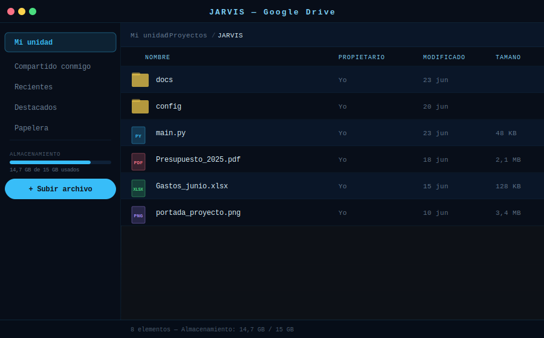

# Modo Google Drive

**Explora, sube, descarga y gestiona tus archivos en Google Drive con control por voz.**

[← README](../README.md) · [Normal](mode-home.md) · [Música](mode-music.md) · [YouTube](mode-youtube.md) · [WhatsApp](mode-whatsapp.md) · [Gmail](mode-gmail.md)

---

## Descripción

El modo Google Drive conecta Jarvis con tu almacenamiento en la nube mediante la Drive API v3 (OAuth 2.0 compartido con Gmail y Calendar). Puedes navegar por carpetas, subir archivos, descargar documentos y buscar contenido con lenguaje natural.

La interfaz muestra una lista de archivos y carpetas con icono, nombre, propietario, fecha de modificación y tamaño. La barra lateral ofrece navegación por secciones (Mi unidad, Compartido, Recientes) y una barra de almacenamiento.

---

## Interfaz

| Elemento | Descripción |
|----------|-------------|
| **Barra lateral** | Mi unidad · Compartido conmigo · Recientes · Destacados · Papelera · Barra de almacenamiento |
| **Lista de archivos** | Icono de tipo · Nombre · Propietario · Fecha de modificación · Tamaño |
| **Breadcrumb** | Ruta de navegación de la carpeta actual |
| **Botón Subir** | Selector de archivo local para subir a la carpeta actual |
| **Vista de archivo** | Preview de documentos y imágenes directamente en Jarvis |

---

## Acciones del asistente

### Navegar y explorar

| Comando de ejemplo | Acción |
|--------------------|--------|
| *"Abre Google Drive"* / *"Abre mi Drive"* | Abre el modo Drive con "Mi unidad" |
| *"Muéstrame los archivos de [carpeta]"* | Navega a esa carpeta |
| *"Vuelve atrás"* | Navega a la carpeta padre |
| *"Abre la carpeta [nombre]"* | Entra en esa carpeta |
| *"Muéstrame los archivos recientes"* | Vista de archivos modificados recientemente |
| *"Muéstrame lo que está compartido conmigo"* | Sección "Compartido conmigo" |
| *"Muéstrame mis archivos destacados"* | Sección de archivos con estrella |

### Buscar archivos

| Comando de ejemplo | Acción |
|--------------------|--------|
| *"Busca el archivo [nombre]"* | Búsqueda por nombre en Drive |
| *"Busca PDFs en Drive"* | Filtra por tipo de archivo |
| *"Busca documentos de [tema]"* | Búsqueda semántica por contenido |
| *"Dónde está el archivo [nombre]?"* | Localiza el archivo y muestra su ruta |
| *"Busca archivos modificados esta semana"* | Filtro por fecha de modificación |

### Subir archivos

| Comando de ejemplo | Acción |
|--------------------|--------|
| *"Sube [ruta del archivo] a Drive"* | Sube el archivo a la carpeta actual |
| *"Sube el PDF del escritorio a Drive"* | Detecta y sube el archivo indicado |
| *"Crea una carpeta llamada [nombre] en Drive"* | Crea nueva carpeta en la ubicación actual |
| *"Sube todos los archivos de [carpeta local] a Drive"* | Sube múltiples archivos |

### Descargar archivos

| Comando de ejemplo | Acción |
|--------------------|--------|
| *"Descarga [nombre del archivo]"* | Descarga a la carpeta de Descargas |
| *"Descarga el archivo [nombre] en [ruta]"* | Descarga en la ruta especificada |
| *"Descarga todos los archivos de [carpeta] de Drive"* | Descarga masiva de carpeta |

### Gestionar archivos

| Comando de ejemplo | Acción |
|--------------------|--------|
| *"Renombra [archivo] a [nuevo nombre]"* | Renombra el archivo en Drive |
| *"Mueve [archivo] a [carpeta]"* | Mueve el archivo entre carpetas |
| *"Borra [archivo]"* | Mueve a la papelera de Drive |
| *"Restaura [archivo] de la papelera"* | Recupera un archivo eliminado |
| *"Vacía la papelera de Drive"* | Elimina permanentemente los archivos en la papelera |
| *"Añade [archivo] a destacados"* | Marca con estrella |

### Compartir y permisos

| Comando de ejemplo | Acción |
|--------------------|--------|
| *"Comparte [archivo] con [email]"* | Da acceso de lectura al archivo |
| *"Da permisos de edición a [email] en [archivo]"* | Acceso de escritura |
| *"Obtén el enlace de [archivo]"* | Copia el enlace compartible al portapapeles |
| *"Haz [archivo] público"* | Cambia el acceso a "cualquiera con el enlace" |
| *"Quita el acceso de [email] en [archivo]"* | Revoca permisos |

### Abre y previsualiza

| Comando de ejemplo | Acción |
|--------------------|--------|
| *"Abre [archivo]"* | Abre el archivo en la app asociada en el SO |
| *"Previsualiza [archivo]"* | Muestra el contenido dentro de Jarvis (imágenes, PDFs) |
| *"Abre [documento] en Google Docs"* | Abre en el editor online de Google |
| *"Muéstrame el contenido de [archivo]"* | Lee y muestra el texto del documento |

---

## Integración con Gmail

Desde el modo Gmail puedes subir adjuntos directamente a Drive:

> *"Sube el adjunto de este email a Drive"*

Y desde Drive puedes adjuntar archivos a un email:

> *"Adjunta [archivo de Drive] a un email para [contacto]"*

---

## Autenticación

Drive usa el **mismo token OAuth** que Gmail y Calendar (login único). Si ya iniciaste sesión, Drive estará disponible sin pasos adicionales.

Scopes necesarios:
- `https://www.googleapis.com/auth/drive` — acceso completo a archivos y carpetas

---

## Almacenamiento

La barra de almacenamiento en la barra lateral muestra el uso actual de tu cuenta de Google:

- **Google Drive**, **Gmail** y **Google Fotos** comparten el mismo almacenamiento de 15 GB.
- Si el almacenamiento está casi lleno, Jarvis te avisará con un mensaje proactivo.
