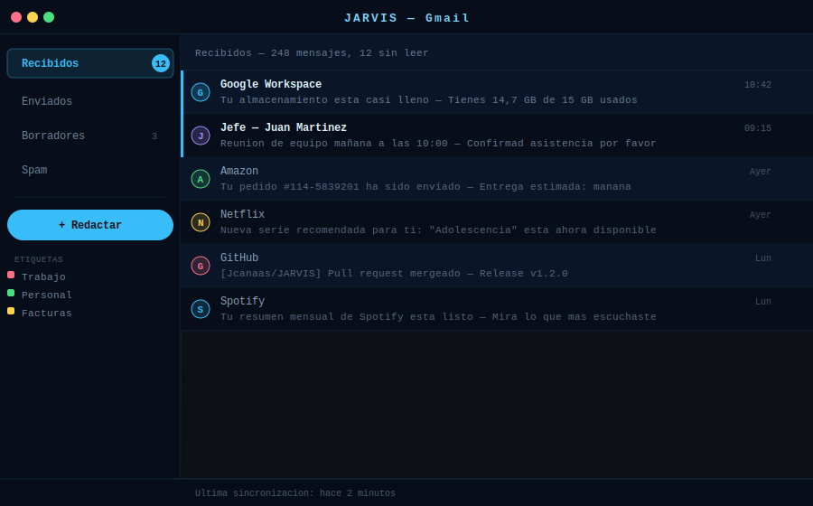

# Modo Gmail

**Gestiona tu bandeja de entrada, redacta correos y organiza tu email con ayuda de IA.**

[← README](../README.md) · [Normal](mode-home.md) · [Música](mode-music.md) · [YouTube](mode-youtube.md) · [WhatsApp](mode-whatsapp.md) · [Drive](mode-drive.md)

---

## Descripción

El modo Gmail conecta Jarvis con tu cuenta de Google mediante la Gmail API (OAuth 2.0). Puedes leer, buscar, responder y redactar correos por voz. La IA de Jarvis puede resumir emails largos, detectar acciones importantes y redactar respuestas en tu estilo.

La interfaz muestra una lista de correos con remitente, asunto, extracto y fecha. La barra lateral ofrece acceso rápido a carpetas, etiquetas y la opción de redactar.

---

## Interfaz

| Elemento | Descripción |
|----------|-------------|
| **Barra lateral** | Recibidos · Enviados · Borradores · Spam · Etiquetas personalizadas · Barra de almacenamiento |
| **Lista de correos** | Remitente con avatar · Asunto · Extracto · Fecha · Indicador de no leídos (barra lateral izquierda) |
| **Vista de email** | Cuerpo completo del correo · Cabeceras · Adjuntos |
| **Botón Redactar** | Abre el compositor de email con asistencia de IA |
| **Estado** | Última sincronización · Número de emails en la carpeta |

---

## Acciones del asistente

### Leer y explorar correos

| Comando de ejemplo | Acción |
|--------------------|--------|
| *"Abre mi Gmail"* / *"Muéstrame mis emails"* | Abre el modo Gmail con la bandeja de entrada |
| *"Cuántos emails sin leer tengo?"* | Cuenta de no leídos |
| *"Lee el último email"* | Muestra y lee en voz alta el correo más reciente |
| *"Lee el email de [remitente]"* | Busca y abre el último correo de ese remitente |
| *"Muéstrame los emails de hoy"* | Filtra por fecha |
| *"Emails sin leer de esta semana"* | Filtro de no leídos de los últimos 7 días |

### Buscar correos

| Comando de ejemplo | Acción |
|--------------------|--------|
| *"Busca emails de [remitente]"* | Filtra por remitente |
| *"Busca emails sobre [tema]"* | Búsqueda por contenido / asunto |
| *"Busca emails con adjuntos de esta semana"* | Filtro de adjuntos recientes |
| *"Busca el pedido de Amazon del mes pasado"* | Búsqueda semántica en el asunto |
| *"Emails de [dominio.com]"* | Filtro por dominio del remitente |

### Redactar y responder

| Comando de ejemplo | Acción |
|--------------------|--------|
| *"Redacta un email a [nombre] sobre [tema]"* | Abre el compositor con borrador generado por IA |
| *"Responde a [nombre] diciendo que confirmo la reunión"* | Responde al último email de esa persona |
| *"Responde al email actual"* | Responde al correo que está abierto en pantalla |
| *"Reenvía este email a [destinatario]"* | Reenvía el correo activo |
| *"Envía el email"* | Envía el borrador actual |
| *"Descarta el borrador"* | Cancela la redacción |

### Gestión de correos

| Comando de ejemplo | Acción |
|--------------------|--------|
| *"Marca este email como leído"* | Cambia el estado de lectura |
| *"Archiva este email"* | Mueve a la carpeta de archivo |
| *"Borra este email"* | Mueve a la papelera |
| *"Marca este email como importante"* | Añade la estrella/etiqueta de importante |
| *"Mueve este email a [carpeta]"* | Mueve a la carpeta indicada |
| *"Marca todos los emails de [remitente] como leídos"* | Acción masiva |

### Resumen e IA

| Comando de ejemplo | Acción |
|--------------------|--------|
| *"Resume este email"* | IA resume el correo activo en 2-3 frases |
| *"Qué me pide en este email?"* | Extrae las acciones solicitadas |
| *"Hay algo urgente en mis emails de hoy?"* | IA prioriza y resume los correos recientes |
| *"Redacta una respuesta profesional a este email"* | IA genera una respuesta formal |
| *"Respóndele en un tono más informal"* | Ajusta el tono de la respuesta |

### Adjuntos

| Comando de ejemplo | Acción |
|--------------------|--------|
| *"Descarga los adjuntos de este email"* | Guarda los adjuntos en Descargas |
| *"Qué adjuntos tiene este email?"* | Lista los archivos adjuntos |
| *"Abre el PDF adjunto"* | Descarga y abre el adjunto |
| *"Sube este archivo a Drive y compártelo"* | Sube adjunto a Google Drive |

---

## Autenticación

Gmail usa el **mismo token OAuth** que Calendar y Drive (login único). Si ya iniciaste sesión para cualquiera de estos servicios, Gmail funcionará sin pasos adicionales.

Scopes necesarios:
- `https://mail.google.com/` — lectura, escritura y envío de emails
- `https://www.googleapis.com/auth/gmail.modify` — gestión de etiquetas y estado de lectura

---

## Privacidad y sincronización

- Los emails se cargan bajo demanda desde la Gmail API — no se almacenan en disco de forma persistente.
- La caché temporal de emails se guarda en `memory/gmail_cache.json` (no en git).
- Las imágenes renderizadas se guardan temporalmente en `memory/gmail_images/` y `memory/gmail_render/` (no en git).
