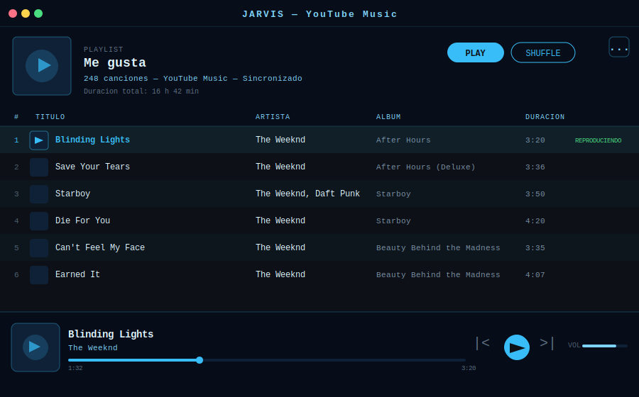

<div align="center">



# Modo YouTube Music

**Reproductor integrado con tu biblioteca de YouTube Music. Playlists, canciones que te gustan, crossfade y control total por voz.**

[← README](../README.md) · [Normal](mode-home.md) · [YouTube](mode-youtube.md) · [WhatsApp](mode-whatsapp.md) · [Gmail](mode-gmail.md) · [Drive](mode-drive.md)

</div>

---

## Descripción

El modo Música conecta Jarvis con tu cuenta de YouTube Music y te permite reproducir cualquier canción, álbum o playlist con comandos de voz naturales. La reproducción se realiza a través de **mpv** (reproductor headless de alta calidad) controlado por IPC, sin abrir ninguna ventana externa.

La interfaz muestra el listado de playlists o las canciones de una playlist en una tabla, con un mini-reproductor en la parte inferior con portada, controles y barra de progreso.

---

## Interfaz

| Elemento | Descripción |
|----------|-------------|
| **Banner de playlist** | Portada · Nombre · Número de canciones · Duración total · Botones Play/Shuffle |
| **Menú ⋯** | Esquina superior derecha del banner — acciones contextuales (Exportar / Crossfade) |
| **Tabla de canciones** | Columnas: # · Título · Artista · Álbum · Duración · Indicador "REPRODUCIENDO" |
| **Mini-reproductor** | Portada · Título · Artista · Barra de progreso · Controles (anterior/pausa/siguiente) · Volumen |
| **Vista de playlists** | Lista de todas tus playlists con conteo de canciones · Menú ⋯ con opción Importar |

### Menú ⋯ — contexto según la vista

| Vista activa | Opciones disponibles |
|-------------|---------------------|
| Lista de playlists | Importar playlist desde archivo |
| Dentro de una playlist | Exportar playlist · Activar/desactivar crossfade · Duración del crossfade |

---

## Acciones del asistente

### Reproducción básica

| Comando de ejemplo | Acción |
|--------------------|--------|
| *"Pon música"* | Reproduce la playlist "Me gusta" en orden o shuffle |
| *"Pon [canción] de [artista]"* | Busca y reproduce la canción |
| *"Pon el álbum [nombre]"* | Reproduce el álbum completo |
| *"Pon la playlist [nombre]"* | Abre y reproduce esa playlist |
| *"Pon algo de [artista]"* | Reproduce canciones del artista |
| *"Shuffle"* / *"Modo aleatorio"* | Activa/desactiva reproducción aleatoria |
| *"Pausa"* / *"Parar"* | Pausa la reproducción |
| *"Continúa"* / *"Reanuda"* | Reanuda desde donde estaba |
| *"Siguiente"* / *"Salta"* | Pasa a la siguiente canción |
| *"Anterior"* | Vuelve a la canción anterior |

### Control de volumen

| Comando de ejemplo | Acción |
|--------------------|--------|
| *"Sube el volumen"* | +10% de volumen |
| *"Baja el volumen"* | -10% de volumen |
| *"Volumen al 50%"* | Ajuste directo a un nivel |
| *"Silencia la música"* | Volumen a 0 (sin parar) |
| *"Pon el volumen máximo"* | Volumen al 100% |

### Navegación y cola

| Comando de ejemplo | Acción |
|--------------------|--------|
| *"Qué está sonando?"* | Nombre de la canción y artista actuales |
| *"Añade [canción] a la cola"* | Encola la canción |
| *"Repite esta canción"* | Bucle de la canción actual |
| *"Ir a la canción número 5"* | Salta a la posición N de la lista |
| *"Avanza 30 segundos"* | Seek adelante en la canción |

### Playlists y biblioteca

| Comando de ejemplo | Acción |
|--------------------|--------|
| *"Muéstrame mis playlists"* | Abre la vista de lista de playlists |
| *"Abre la playlist [nombre]"* | Navega a esa playlist |
| *"Muéstrame mis canciones que me gustan"* | Abre la playlist "Me gusta" |
| *"Cuántas canciones tengo en [playlist]?"* | Info de la playlist |
| *"Crea una playlist llamada [nombre]"* | Crea nueva playlist en YouTube Music |

### Exportación e importación

| Acción | Cómo hacerlo |
|--------|--------------|
| **Exportar playlist** | Menú ⋯ → "Exportar playlist" · Elige ruta y nombre del archivo |
| **Exportar canciones que me gustan** | Menú ⋯ → "Exportar playlist" (desde "Me gusta") |
| **Importar playlist** | Desde la vista de playlists: Menú ⋯ → "Importar playlist" · Selecciona el JSON |
| **Reproducir desde archivo** | *"Reproduce el archivo [ruta]"* — carga y reproduce el JSON exportado |

**Formato del archivo exportado:**

```json
{
  "jarvis_playlist": true,
  "version": 1,
  "name": "Me gusta",
  "type": "liked",
  "exported_at": "2025-06-23T14:30:00",
  "tracks": [
    {
      "title": "Blinding Lights",
      "artists": ["The Weeknd"],
      "video_id": "4NRXx6U8ABQ",
      "duration_seconds": 200,
      "album": "After Hours",
      "is_video": false
    }
  ]
}
```

> Los vídeos musicales se identifican por `video_id` (no por título), por lo que la importación funciona aunque la URL cambie de dominio.

### Crossfade

| Acción | Cómo hacerlo |
|--------|--------------|
| **Activar crossfade** | Menú ⋯ → "Crossfade" → activar el toggle |
| **Desactivar crossfade** | Menú ⋯ → "Crossfade" → desactivar el toggle |
| **Cambiar duración** | Menú ⋯ → "Duración del crossfade" → elige segundos (1–10) |
| **Por voz** | *"Activa el crossfade de 5 segundos"* |

El crossfade reduce gradualmente el volumen en los últimos N segundos de la canción actual y lo sube suavemente al empezar la siguiente.

### Login y cuenta

| Comando de ejemplo | Acción |
|--------------------|--------|
| *"Inicia sesión en YouTube Music"* | Abre el navegador para autorizar con Google |
| *"Cierra sesión de YouTube Music"* | Elimina el token de autenticación |
| *"Estás conectado a YouTube Music?"* | Verifica el estado de la sesión |

---

## Reproductor mpv

Jarvis usa **mpv** como motor de audio, lo que garantiza:

- Reproducción de alta calidad sin ventana visible
- Control por IPC (named pipe `\\.\pipe\jarvis_mpv`)
- Cierre automático si Jarvis se cierra (incluso por Task Manager) gracias al **Windows Job Object**
- Compatibilidad con YouTube, SoundCloud y cualquier URL soportada por yt-dlp

---

## Atajos de teclado

Mientras el reproductor está activo puedes controlar la reproducción desde el teclado (ver `doc/mpbindings.png` para el mapa completo):

| Tecla | Acción |
|-------|--------|
| `Espacio` | Pausa / Reanuda |
| `→` / `←` | +5s / -5s |
| `↑` / `↓` | Volumen +2% / -2% |
| `N` | Siguiente canción |
| `P` | Canción anterior |
