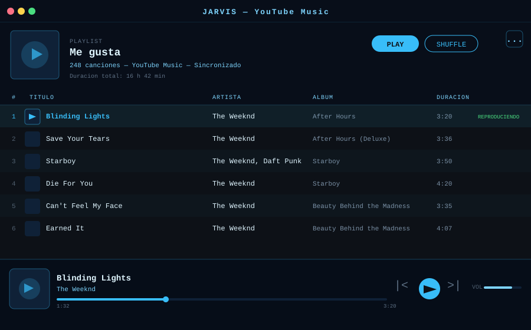

<div align="center">



# Modo YouTube Music

**Reproductor integrado con tu biblioteca de YouTube Music. Playlists, canciones que te gustan, crossfade y control total por voz.**

[← README](../README.md) · [Normal](mode-home.md) · [YouTube](mode-youtube.md) · [WhatsApp](mode-whatsapp.md) · [Gmail](mode-gmail.md) · [Drive](mode-drive.md)

</div>

---

## Descripción

El modo Música conecta Jarvis con tu cuenta de YouTube Music y te permite reproducir cualquier canción, álbum o playlist con comandos de voz naturales. La reproducción se realiza a través de **mpv** (reproductor headless de alta calidad) controlado por IPC, sin abrir ninguna ventana externa.

La interfaz muestra el listado de playlists o las canciones de una playlist en una tabla, con un mini-reproductor en la parte inferior con portada, controles y barra de progreso.

---

## Interfaz

| Elemento | Descripción |
|----------|-------------|
| **Banner de playlist** | Portada · Nombre · Número de canciones · Duración total · Botones Play/Shuffle |
| **Menú ⋯** | Esquina superior derecha del banner — acciones contextuales (Exportar / Crossfade) |
| **Tabla de canciones** | Columnas: # · Título · Artista · Álbum · Duración · Indicador "REPRODUCIENDO" |
| **Mini-reproductor** | Portada · Título · Artista · Barra de progreso · Controles (anterior/pausa/siguiente) · Volumen |
| **Vista de playlists** | Lista de todas tus playlists con conteo de canciones · Menú ⋯ con opción Importar |

### Menú ⋯ — contexto según la vista

| Vista activa | Opciones disponibles |
|-------------|---------------------|
| Lista de playlists | Importar playlist desde archivo |
| Dentro de una playlist | Exportar playlist · Activar/desactivar crossfade · Duración del crossfade |

---

## Acciones del asistente

### Reproducción básica

| Comando de ejemplo | Acción |
|--------------------|--------|
| *"Pon música"* | Reproduce la playlist "Me gusta" en orden o shuffle |
| *"Pon [canción] de [artista]"* | Busca y reproduce la canción |
| *"Pon el álbum [nombre]"* | Reproduce el álbum completo |
| *"Pon la playlist [nombre]"* | Abre y reproduce esa playlist |
| *"Pon algo de [artista]"* | Reproduce canciones del artista |
| *"Shuffle"* / *"Modo aleatorio"* | Activa/desactiva reproducción aleatoria |
| *"Pausa"* / *"Parar"* | Pausa la reproducción |
| *"Continúa"* / *"Reanuda"* | Reanuda desde donde estaba |
| *"Siguiente"* / *"Salta"* | Pasa a la siguiente canción |
| *"Anterior"* | Vuelve a la canción anterior |

### Control de volumen

| Comando de ejemplo | Acción |
|--------------------|--------|
| *"Sube el volumen"* | +10% de volumen |
| *"Baja el volumen"* | -10% de volumen |
| *"Volumen al 50%"* | Ajuste directo a un nivel |
| *"Silencia la música"* | Volumen a 0 (sin parar) |
| *"Pon el volumen máximo"* | Volumen al 100% |

### Navegación y cola

| Comando de ejemplo | Acción |
|--------------------|--------|
| *"Qué está sonando?"* | Nombre de la canción y artista actuales |
| *"Añade [canción] a la cola"* | Encola la canción |
| *"Repite esta canción"* | Bucle de la canción actual |
| *"Ir a la canción número 5"* | Salta a la posición N de la lista |
| *"Avanza 30 segundos"* | Seek adelante en la canción |

### Playlists y biblioteca

| Comando de ejemplo | Acción |
|--------------------|--------|
| *"Muéstrame mis playlists"* | Abre la vista de lista de playlists |
| *"Abre la playlist [nombre]"* | Navega a esa playlist |
| *"Muéstrame mis canciones que me gustan"* | Abre la playlist "Me gusta" |
| *"Cuántas canciones tengo en [playlist]?"* | Info de la playlist |
| *"Crea una playlist llamada [nombre]"* | Crea nueva playlist en YouTube Music |

### Exportación e importación

| Acción | Cómo hacerlo |
|--------|--------------|
| **Exportar playlist** | Menú ⋯ → "Exportar playlist" · Elige ruta y nombre del archivo |
| **Exportar canciones que me gustan** | Menú ⋯ → "Exportar playlist" (desde "Me gusta") |
| **Importar playlist** | Desde la vista de playlists: Menú ⋯ → "Importar playlist" · Selecciona el JSON |
| **Reproducir desde archivo** | *"Reproduce el archivo [ruta]"* — carga y reproduce el JSON exportado |

**Formato del archivo exportado:**

```json
{
  "jarvis_playlist": true,
  "version": 1,
  "name": "Me gusta",
  "type": "liked",
  "exported_at": "2025-06-23T14:30:00",
  "tracks": [
    {
      "title": "Blinding Lights",
      "artists": ["The Weeknd"],
      "video_id": "4NRXx6U8ABQ",
      "duration_seconds": 200,
      "album": "After Hours",
      "is_video": false
    }
  ]
}
```

> Los vídeos musicales se identifican por `video_id` (no por título), por lo que la importación funciona aunque la URL cambie de dominio.

### Crossfade

| Acción | Cómo hacerlo |
|--------|--------------|
| **Activar crossfade** | Menú ⋯ → "Crossfade" → activar el toggle |
| **Desactivar crossfade** | Menú ⋯ → "Crossfade" → desactivar el toggle |
| **Cambiar duración** | Menú ⋯ → "Duración del crossfade" → elige segundos (1–10) |
| **Por voz** | *"Activa el crossfade de 5 segundos"* |

El crossfade reduce gradualmente el volumen en los últimos N segundos de la canción actual y lo sube suavemente al empezar la siguiente.

### Descargas: formato y metadatos

Las descargas se guardan como **`.m4a` (MP4/AAC)**, no como el `.webm`/`.opus` que
YouTube sirve por defecto: el m4a se reproduce en cualquier móvil (iPhone
incluido), coche o reproductor, y admite carátula embebida.

Cada archivo se etiqueta automáticamente después de descargarse con título,
artista, artista del álbum, álbum, **género**, año, número de pista y **carátula**
embebida. Los datos salen de YouTube Music y de yt-dlp; lo que falte (el género
casi siempre) se completa con una búsqueda en iTunes.

| Acción | Cómo hacerlo |
|--------|--------------|
| **Reparar descargas antiguas** | *"Repara los metadatos de la música"* (acción `retag_downloads`) |

La reparación recorre `Descargas/JARVIS_Audio` con 4 hilos y, por cada archivo:

1. Convierte a `.m4a` si está en un contenedor que el móvil no abre. **No hace
   falta instalar nada**: el conversor es el propio `mpv.exe` que Jarvis ya
   incluye para reproducir (`--o=` usa su libavcodec). Si hay un `ffmpeg` en la
   raíz o en el PATH, se prefiere ese.
2. Saca el `videoId` del nombre (`NNN - Título [videoId].ext`) y pregunta a
   YouTube Music por el artista y la carátula reales — los nombres de archivo
   antiguos no llevan artista.
3. Escribe las etiquetas y completa género/álbum con iTunes.

> Un `.webm` **no** se puede etiquetar en el sitio: es un contenedor Matroska y
> mutagen no lo abre. O se convierte, o se queda sin metadatos; por eso la
> acción informa aparte de los archivos que quedaron sin tocar.

Mientras corre usa la misma tarjeta de progreso que las descargas: porcentaje,
`archivo actual`, `N/total` y tiempo restante estimado, con el botón de cancelar
activo. Cancelar detiene el proceso en cuanto termina el archivo en curso.
Relanzarla continúa donde lo dejó: los archivos que ya tienen título, artista y
carátula se detectan y se saltan sin tocar la red.

### Login y cuenta

| Comando de ejemplo | Acción |
|--------------------|--------|
| *"Inicia sesión en YouTube Music"* | Abre el navegador para autorizar con Google |
| *"Cierra sesión de YouTube Music"* | Elimina el token de autenticación |
| *"Estás conectado a YouTube Music?"* | Verifica el estado de la sesión |

---

## Reproductor mpv

Jarvis usa **mpv** como motor de audio, lo que garantiza:

- Reproducción de alta calidad sin ventana visible
- Control por IPC (named pipe `\\.\pipe\jarvis_mpv`)
- Cierre automático si Jarvis se cierra (incluso por Task Manager) gracias al **Windows Job Object**
- Compatibilidad con YouTube, SoundCloud y cualquier URL soportada por yt-dlp

---

## Cómo se resuelve el stream (canciones no descargadas)

Una canción que no está en la biblioteca offline necesita que yt-dlp traduzca el
`videoId` a una URL del CDN antes de que mpv pueda abrirla. Ese paso es el que
manda en cuánto tarda en empezar a sonar, así que conviene saber cómo funciona:

1. `_ytdlp_module_stream()` resuelve **dentro del proceso** con la librería
   `yt_dlp`. `yt-dlp.exe` es un bundle de PyInstaller que se descomprime en cada
   invocación: medido aquí, ~4,5 s por subproceso frente a ~2,2 s en proceso.
2. Primero se intenta **sin cookies**. Sacar cookies de un navegador abierto
   cuesta segundos y falla del todo mientras el navegador tiene bloqueada su
   base de datos (`Could not copy Chrome cookie database`), lo que tumbaba la
   resolución entera. Solo se reintenta con cookies si el intento anónimo es
   rechazado.
3. mpv se arranca **sin** `cookies-from-browser`: su `ytdl_hook` no tiene pase de
   reintento, así que unas cookies bloqueadas dejaban la canción sin sonar.
4. `_play_video()` espera hasta `_STREAM_RESOLVE_WAIT` (9 s) a una resolución ya
   en marcha. Con el tope anterior (3,5 s, más corto que una resolución normal)
   se tiraba el resultado del prefetch y mpv repetía exactamente el mismo trabajo.

Al cargar una pista se precalienta la siguiente (`_prefetch_next_tracks`), por lo
que un salto manual suele sonar en menos de un segundo.

---

## Por qué mpv reproduce desde `127.0.0.1`

YouTube dejó de servir rangos grandes. Medido contra el CDN:

| petición | respuesta |
|---|---|
| `Range: bytes=0-1048576` | `206` |
| `Range: bytes=0-1310720` | `403` |
| `Range: bytes=0-` (abierto) | `403` |
| sin `Range` | `403` |

ffmpeg —y por tanto mpv— abre **todo** stream con un rango abierto, así que
ninguna canción en streaming llegaba a sonar: mpv daba `403`, su `ytdl_hook`
reintentaba con yt-dlp, fallaba igual y terminaba en `loading failed (reason 4)`.
Encima cada fallo disparaba los reintentos de `_verify_stream_started`, que es de
donde salían las esperas de decenas de segundos.

[`actions/stream_proxy.py`](../actions/stream_proxy.py) es un servidor HTTP en
`127.0.0.1` (puerto efímero, un token impredecible por pista) que acepta el rango
abierto que mpv exige y lo resuelve pidiendo al CDN trozos de 1 MiB. El seek
sigue funcionando porque el proxy habla rangos de bytes de verdad, y si la URL
firmada caduca a mitad de canción se vuelve a resolver sin cortar el audio.

---

## Reproducir desde el móvil

En el escritorio, **seleccionar** una fila precalienta el stream y el doble clic
posterior es instantáneo. En el móvil tocar *es* reproducir: no hay paso previo,
así que cada toque pagaba la resolución entera. Medido en el camino real
(`POST /api/music/...` con el reproductor de verdad):

| | antes | ahora |
|---|---|---|
| `play_tracks`, pista fría (HTTP bloqueado) | 3,10 s | 0,16 s |
| hasta oírse | 4,11 s | 1,09 s |
| `jump_to` desde la cola | 2,24 s | 0,86 s |

Dos piezas:

- `POST /api/music/prefetch` calienta streams **fuera** del worker serializado de
  reproducción (solo lanza hilos de resolución), así que nunca se cruza con una
  orden de transporte. La app lo llama al pintar una playlist, una búsqueda, la
  ficha de un artista o la cola, con un tope de 3 pistas por petición.
- `POST /api/music/<acción>` ya no bloquea hasta 5 s para acabar devolviendo un
  error que la app se tragaba en silencio: espera `_MUSIC_ACTION_WAIT_SECONDS`
  (2 s) y, si sigue en marcha, responde `202 {"ok": true, "pending": true}`. La
  app pinta al instante la pista tocada y el sondeo de estado la confirma.

---

## Una pulsación, una canción

El worker de autoplay adelanta la pista al llegar al final. Tres reglas evitan
que un salto se convierta en dos:

- Si el `videoId` cambió mientras se leía el estado de mpv, la muestra se
  **descarta**: llevaba la posición de la pista anterior, ya casi en el final, y
  disparaba un segundo avance.
- `_AUTOPLAY_COOLDOWN_SECONDS` (6 s) cuenta desde **cualquier** cambio de pista,
  también los que pide el usuario desde el móvil o el escritorio.
- Una transición nueva **cancela** el crossfade en curso (`_cancel_crossfade`).
  Si no, el fade terminaba promocionando la pista que el usuario acababa de
  saltarse, justo después de la que sí había pedido.

---

## Móvil y escritorio muestran lo mismo

`/api/status` lee el estado de reproducción del reproductor headless
(`ytmusic_headless.current()`), no del espejo que mantiene la ventana del
escritorio. Ese espejo se refresca con un sondeo de 1 s cuyo resultado se aplica
en el hilo de la GUI, así que justo después de pulsar algo en el móvil todavía
describía el estado anterior: el escritorio se veía bien y el móvil se veía mal,
para la misma acción. Si no hay reproductor headless (backend GUI), se sigue
usando el espejo de la ventana.

---

## Atajos de teclado

Mientras el reproductor está activo puedes controlar la reproducción desde el teclado (ver `doc/mpbindings.png` para el mapa completo):

| Tecla | Acción |
|-------|--------|
| `Espacio` | Pausa / Reanuda |
| `→` / `←` | +5s / -5s |
| `↑` / `↓` | Volumen +2% / -2% |
| `N` | Siguiente canción |
| `P` | Canción anterior |
