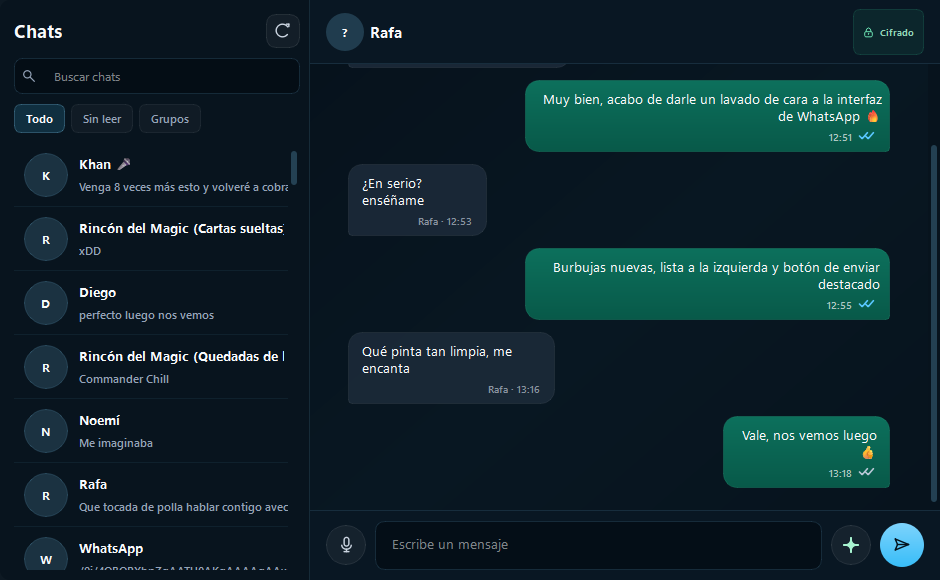

<div align="center">



# Modo WhatsApp

**Lee, responde y gestiona tus conversaciones de WhatsApp desde Jarvis, con IA para redactar mensajes.**

[← README](../README.md) · [Normal](mode-home.md) · [Música](mode-music.md) · [YouTube](mode-youtube.md) · [Gmail](mode-gmail.md) · [Drive](mode-drive.md)

</div>

---

## Descripción

El modo WhatsApp conecta Jarvis con WhatsApp Web a través de un bridge Node.js local (`whatsapp-web.js`). Puedes leer todos tus chats, ver el historial de cada conversación, y enviar mensajes con redacción asistida por IA — todo por voz o texto desde la interfaz de Jarvis.

La primera vez que abres el modo WhatsApp, Jarvis muestra un código QR para vincular tu teléfono. Una vez vinculado, la sesión persiste hasta que cierres sesión desde el teléfono.

---

## Interfaz

| Elemento | Descripción |
|----------|-------------|
| **Lista de chats** | Todos tus chats con avatar · Nombre · Último mensaje · Hora · Contador de no leídos |
| **Vista de conversación** | Historial de mensajes con burbujas · Fecha · Estado de lectura |
| **Panel de envío** | Campo de texto + botón enviar · Redacción asistida por IA |
| **Código QR** | Se muestra en el panel si no hay sesión activa — escanea con el teléfono |
| **Indicador de estado** | Verde: conectado · Naranja: reconectando · Rojo: sin sesión |

---

## Primera configuración

1. Abre el modo WhatsApp en Jarvis.
2. Aparece el código QR en el panel.
3. En tu teléfono: **WhatsApp → Dispositivos vinculados → Vincular dispositivo**.
4. Escanea el QR con la cámara.
5. La vista del panel cambia automáticamente a la lista de chats.

> La sesión se guarda localmente. No necesitas volver a escanear a menos que cierres sesión desde el teléfono o elimines los datos de sesión.

---

## Acciones del asistente

### Leer mensajes

| Comando de ejemplo | Acción |
|--------------------|--------|
| *"Muéstrame mis mensajes de WhatsApp"* | Abre el modo WhatsApp y carga los chats |
| *"Tengo mensajes nuevos?"* | Resume los mensajes sin leer |
| *"Abre el chat con [nombre]"* | Abre la conversación con ese contacto |
| *"Qué me ha dicho [nombre] últimamente?"* | Muestra el historial reciente |
| *"Lee el último mensaje de [nombre]"* | Lee en voz alta el último mensaje |
| *"Cuántos mensajes sin leer tengo?"* | Cuenta de mensajes no leídos total |

### Enviar mensajes

| Comando de ejemplo | Acción |
|--------------------|--------|
| *"Manda un WhatsApp a [nombre]: [mensaje]"* | Envía el mensaje directamente |
| *"Responde a [nombre] que llegaré tarde"* | Redacta y envía una respuesta corta |
| *"Dile a [nombre] que no puedo ir mañana"* | Jarvis redacta el mensaje con IA y lo envía |
| *"Responde al último mensaje de [nombre]"* | Jarvis sugiere una respuesta contextual |
| *"Envía un mensaje de voz a [nombre]"* | Graba y envía un audio (si está disponible) |

### Grupos

| Comando de ejemplo | Acción |
|--------------------|--------|
| *"Abre el grupo [nombre]"* | Abre la conversación del grupo |
| *"Mensajes nuevos en el grupo [nombre]?"* | Resume los mensajes sin leer del grupo |
| *"Manda un mensaje al grupo [nombre]: [texto]"* | Envía al grupo |
| *"Quién ha escrito en [grupo] hoy?"* | Lista de participantes activos hoy |

### Gestión y búsqueda

| Comando de ejemplo | Acción |
|--------------------|--------|
| *"Busca mensajes de [nombre] sobre [tema]"* | Búsqueda en el historial |
| *"Marca como leído el chat de [nombre]"* | Marca mensajes como leídos |
| *"Muéstrame los chats con mensajes sin leer"* | Filtra solo no leídos |

### Redacción asistida por IA

Cuando le pides a Jarvis que envíe un mensaje con intención ("dile que...", "respóndele que..."), la IA:

1. Analiza el contexto de la conversación previa
2. Redacta un mensaje natural y apropiado al tono
3. Te muestra el borrador para confirmación (o lo envía directamente si especificas "sin confirmar")

| Comando de ejemplo | Acción |
|--------------------|--------|
| *"Redacta un mensaje para [nombre] disculpándome por el retraso"* | Sugiere un mensaje, espera confirmación |
| *"Manda a [nombre] un recordatorio de la reunión de mañana"* | Crea y envía directamente |
| *"Responde a todos los mensajes sin leer con un mensaje de que estoy ocupado"* | Respuesta masiva con confirmación previa |

---

## Bridge de WhatsApp

El bridge es un proceso Node.js (`whatsapp_bridge/`) que corre en segundo plano. Jarvis lo gestiona automáticamente:

- Se inicia cuando abres el modo WhatsApp
- Se reinicia automáticamente si falla
- Se cierra cuando cierras Jarvis
- Los logs están en `logs/node.log` y `logs/node.err`

### Diagnóstico

Si el QR no aparece o la conexión falla:

```powershell
# Ver logs del bridge en tiempo real
Get-Content .\logs\node.err -Tail 50 -Wait
Get-Content .\logs\node.log -Tail 50 -Wait
```

---

## Privacidad

- Los mensajes se procesan **localmente** — no se envían a ningún servidor externo más allá de WhatsApp Web.
- La sesión se guarda en `whatsapp_bridge/.wwebjs_auth/` (no en git, en `.gitignore`).
- El historial de conversaciones no se almacena en Jarvis — solo se carga bajo demanda desde WhatsApp Web.
