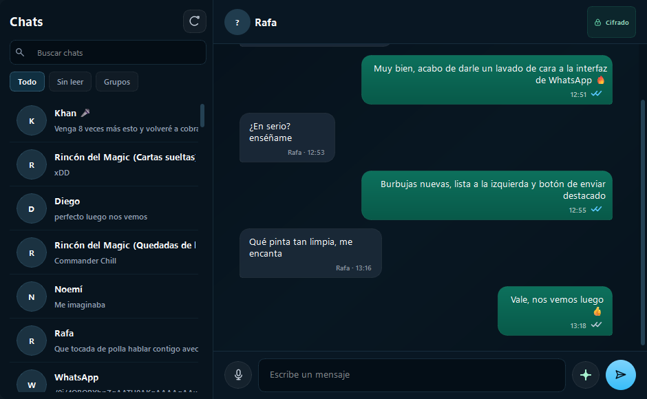

<div align="center">



# Modo WhatsApp

**Lee, responde y gestiona tus conversaciones de WhatsApp desde Jarvis, con IA para redactar mensajes.**

[← README](../README.md) · [Normal](mode-home.md) · [Música](mode-music.md) · [YouTube](mode-youtube.md) · [Gmail](mode-gmail.md) · [Drive](mode-drive.md)

</div>

---

## Descripción

El modo WhatsApp conecta Jarvis con WhatsApp Web a través de un bridge Node.js local (`whatsapp-web.js`). Puedes leer todos tus chats, ver el historial de cada conversación, y enviar mensajes con redacción asistida por IA — todo por voz o texto desde la interfaz de Jarvis.

La primera vez que abres el modo WhatsApp, Jarvis muestra un código QR para vincular tu teléfono. Una vez vinculado, la sesión persiste hasta que cierres sesión desde el teléfono.

---

## Interfaz

| Elemento | Descripción |
|----------|-------------|
| **Lista de chats** | Todos tus chats con avatar · Nombre · Último mensaje · Hora · Contador de no leídos |
| **Vista de conversación** | Historial de mensajes con burbujas · Fecha · Estado de lectura |
| **Panel de envío** | Campo de texto + botón enviar · Redacción asistida por IA |
| **Código QR** | Se muestra en el panel si no hay sesión activa — escanea con el teléfono |
| **Indicador de estado** | Verde: conectado · Naranja: reconectando · Rojo: sin sesión |

Los contadores y la lista de pendientes se reconcilian con el estado de no leídos de WhatsApp. El historial recuperado al conectar no se considera automáticamente pendiente de respuesta, y leer o responder desde otro dispositivo limpia ese estado.

Al abrir un chat con mensajes sin leer, la conversación se sitúa en el primer no leído con un separador verde. Si la página cargada no llega tan atrás, no se pinta separador en vez de marcarlo en un sitio incorrecto.

### Atajos de teclado

| Atajo | Acción |
|-------|--------|
| `Ctrl+F` | Abre/cierra la búsqueda dentro de la conversación abierta |
| `Ctrl+K` | Foco en la búsqueda de la lista de chats |
| `Intro` (en la búsqueda) | Salta al siguiente resultado |
| `Mayús+Intro` (en la búsqueda) | Salta al resultado anterior |
| `Esc` (en la búsqueda) | Cierra la búsqueda |
| `Esc` (en el compositor) | Cancela responder/editar |
| `Mayús+Intro` (en el compositor) | Salto de línea sin enviar |

La búsqueda dentro de la conversación solo encuentra mensajes ya cargados en pantalla (hasta 800, o los que traiga la paginación al subir) — no dispara una búsqueda contra el histórico completo del bridge.

Los envíos distinguen entre **enviando**, **confirmando** y **no enviado**. Si la petición HTTP agota el tiempo pero WhatsApp puede seguir procesándola, la interfaz conserva el mensaje como “confirmando”; desde su menú contextual se puede comprobar o reintentar usando la misma clave idempotente, sin producir un segundo envío.

---

## Tipos de mensaje

| Tipo | Cómo se muestra |
|------|-----------------|
| Texto | Burbuja con menciones resueltas a nombre |
| Respuesta (cita) | Bloque con autor y extracto; clic salta al original cuando el mensaje citado tiene id |
| Imagen · vídeo · sticker · GIF | Miniatura; imágenes en visor propio, vídeo en el reproductor del sistema |
| Audio · nota de voz | Reproductor en línea con velocidad y transcripción opcional |
| Documento | Nombre de archivo, tamaño y tipo MIME, con botón de abrir |
| Ubicación | Tarjeta con nombre, dirección, coordenadas y enlace al mapa |
| Contacto / vCard | Tarjeta con nombre y teléfonos (una por contacto en los multi-vCard) |
| Encuesta | Pregunta y opciones |
| Reacciones | Resumen de emojis agrupados bajo la burbuja |
| Edición | El cuerpo se actualiza en su sitio y se marca «editado» |
| Borrado / revocación | Queda «[mensaje eliminado]» en cursiva; se descarta el contenido original |
| Adjunto con texto | El texto se muestra como pie del adjunto |

### No soportado (y por qué)

- **Votos de las encuestas**: el bridge no expone los recuentos, así que la tarjeta muestra la pregunta y las opciones sin porcentajes inventados. Votar se hace desde el teléfono.
- **Reproducción de vídeo dentro de la app**: se abre en el reproductor del sistema.
- **Pedidos, pagos, productos, listas y mensajes interactivos**: se identifican por nombre («[Pedido]», «[Pago]», …) pero no se renderiza su contenido.
- **Tipos nuevos de WhatsApp**: se muestran con su nombre técnico entre corchetes en lugar de una burbuja vacía, para que un tipo sin soporte se vea como tal.

---

## Primera configuración

1. Abre el modo WhatsApp en Jarvis.
2. Aparece el código QR en el panel.
3. En tu teléfono: **WhatsApp → Dispositivos vinculados → Vincular dispositivo**.
4. Escanea el QR con la cámara.
5. La vista del panel cambia automáticamente a la lista de chats.

> La sesión se guarda localmente. No necesitas volver a escanear a menos que cierres sesión desde el teléfono o elimines los datos de sesión.

---

## Acciones del asistente

### Leer mensajes

| Comando de ejemplo | Acción |
|--------------------|--------|
| *"Muéstrame mis mensajes de WhatsApp"* | Abre el modo WhatsApp y carga los chats |
| *"Tengo mensajes nuevos?"* | Resume los mensajes sin leer |
| *"Abre el chat con [nombre]"* | Abre la conversación con ese contacto |
| *"Qué me ha dicho [nombre] últimamente?"* | Muestra el historial reciente |
| *"Lee el último mensaje de [nombre]"* | Lee en voz alta el último mensaje |
| *"Cuántos mensajes sin leer tengo?"* | Cuenta de mensajes no leídos total |

### Enviar mensajes

| Comando de ejemplo | Acción |
|--------------------|--------|
| *"Manda un WhatsApp a [nombre]: [mensaje]"* | Envía el mensaje directamente |
| *"Responde a [nombre] que llegaré tarde"* | Redacta y envía una respuesta corta |
| *"Dile a [nombre] que no puedo ir mañana"* | Jarvis redacta el mensaje con IA y lo envía |
| *"Responde al último mensaje de [nombre]"* | Jarvis sugiere una respuesta contextual |
| *"Envía un mensaje de voz a [nombre]"* | Graba y envía un audio (si está disponible) |

### Grupos

| Comando de ejemplo | Acción |
|--------------------|--------|
| *"Abre el grupo [nombre]"* | Abre la conversación del grupo |
| *"Mensajes nuevos en el grupo [nombre]?"* | Resume los mensajes sin leer del grupo |
| *"Manda un mensaje al grupo [nombre]: [texto]"* | Envía al grupo |
| *"Quién ha escrito en [grupo] hoy?"* | Lista de participantes activos hoy |

### Gestión y búsqueda

| Comando de ejemplo | Acción |
|--------------------|--------|
| *"Busca mensajes de [nombre] sobre [tema]"* | Búsqueda en el historial |
| *"Marca como leído el chat de [nombre]"* | Marca mensajes como leídos |
| *"Muéstrame los chats con mensajes sin leer"* | Filtra solo no leídos |

### Redacción asistida por IA

Cuando le pides a Jarvis que envíe un mensaje con intención ("dile que...", "respóndele que..."), la IA:

1. Analiza el contexto de la conversación previa
2. Redacta un mensaje natural y apropiado al tono
3. Te muestra el borrador para confirmación (o lo envía directamente si especificas "sin confirmar")

| Comando de ejemplo | Acción |
|--------------------|--------|
| *"Redacta un mensaje para [nombre] disculpándome por el retraso"* | Sugiere un mensaje, espera confirmación |
| *"Manda a [nombre] un recordatorio de la reunión de mañana"* | Crea y envía directamente |
| *"Responde a todos los mensajes sin leer con un mensaje de que estoy ocupado"* | Respuesta masiva con confirmación previa |

---

## Bridge de WhatsApp

El bridge es un proceso Node.js (`whatsapp_bridge/`) que corre en segundo plano. Jarvis lo gestiona automáticamente:

- Se inicia junto con Jarvis para poder recibir mensajes y actualizar el contador aunque el modo no esté abierto
- Se reinicia automáticamente si falla
- Se cierra cuando cierras Jarvis
- Los logs están en `%LOCALAPPDATA%\Jarvis\logs\bridge.log` en Windows

### Diagnóstico

Si el QR no aparece o la conexión falla:

```powershell
# Ver logs del bridge en tiempo real
Get-Content "$env:LOCALAPPDATA\Jarvis\logs\bridge.log" -Tail 50 -Wait
```

---

## Privacidad

- El bridge y la interfaz procesan los mensajes localmente. Las funciones manuales de IA y las opciones de traducción o transcripción automática usan Google Gemini y envían allí el texto o audio necesario.
- La traducción y transcripción automáticas están desactivadas por defecto y se activan por separado en **Ajustes → WhatsApp → Procesamiento con IA**.
- La sesión se guarda en `%LOCALAPPDATA%\Jarvis\whatsapp_bridge\` en Windows, fuera del repositorio.
- Para permitir sincronización y recuperación tras reinicios, el bridge conserva localmente un buffer de hasta 1000 mensajes y Jarvis guarda los pendientes durante un máximo de 24 horas.
