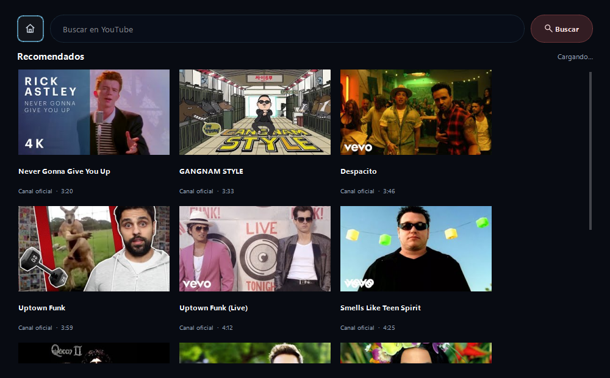
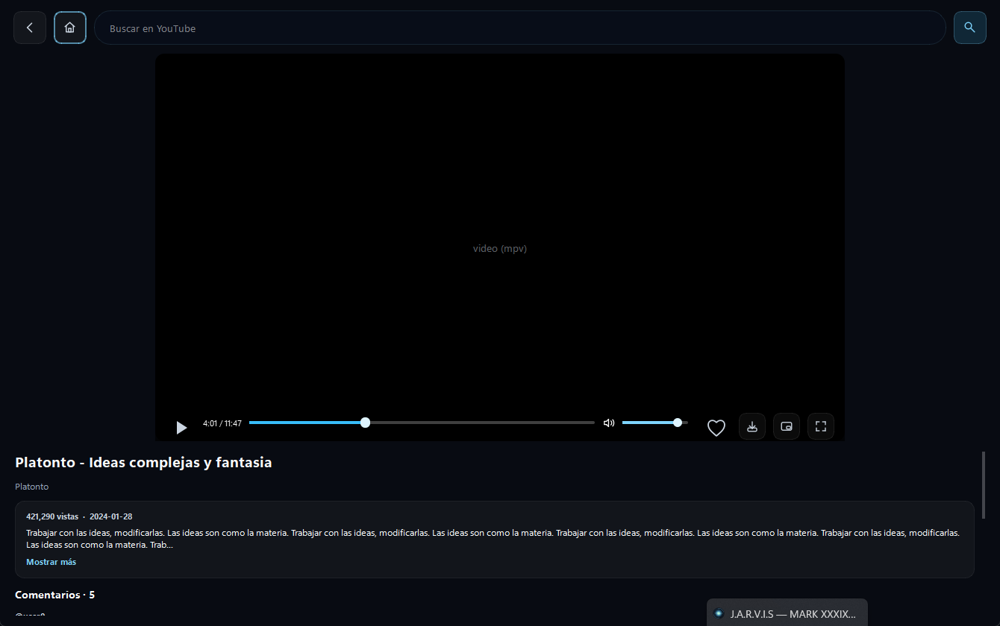
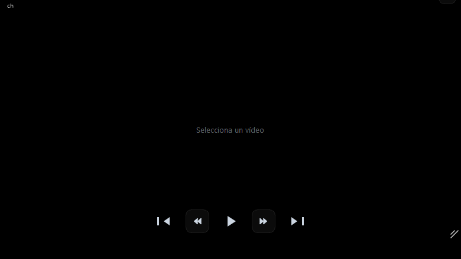
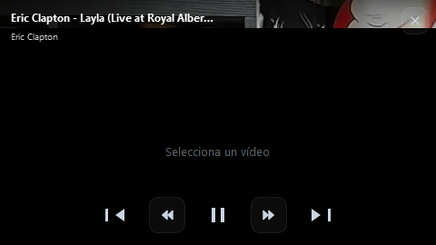

# Modo YouTube Video

**Búsqueda, exploración y reproducción de vídeos de YouTube con reproductor flotante integrado.**

[← README](../README.md) · [Normal](mode-home.md) · [Música](mode-music.md) · [WhatsApp](mode-whatsapp.md) · [Gmail](mode-gmail.md) · [Drive](mode-drive.md)

---

## Descripción

El modo YouTube permite buscar y reproducir vídeos de YouTube directamente en Jarvis. Los resultados se muestran en una cuadrícula con miniaturas, título, canal y duración. Al seleccionar un vídeo, se abre un **reproductor flotante** que puedes mover, redimensionar y mantener sobre otras ventanas mientras trabajas.

---

## Interfaz

| Elemento | Descripción |
|----------|-------------|
| **Cuadrícula de vídeos** | Miniaturas · Título · Canal · Duración · Vistas |
| **Barra de búsqueda** | Campo de texto para buscar o explorar por categoría |
| **Reproductor flotante** | Ventana arrastrable y redimensionable · Always-on-top opcional |
| **Controles del reproductor** | Play/pausa · Volumen · Pantalla completa · Cerrar |
| **Panel de info** | Título del vídeo · Canal · Descripción · Likes |

---

## Capturas de pantalla

<table>
<tr>
<td></td>
<td></td>
</tr>
<tr>
<td align="center"><em>Vista en cuadrícula con resultados de búsqueda</em></td>
<td align="center"><em>Reproductor flotante en modo watch</em></td>
</tr>
</table>

<table>
<tr>
<td></td>
<td></td>
</tr>
<tr>
<td align="center"><em>Reproductor redimensionado</em></td>
<td align="center"><em>Vista compacta — trabaja y ve vídeos a la vez</em></td>
</tr>
</table>

---

## Acciones del asistente

### Búsqueda y reproducción

| Comando de ejemplo | Acción |
|--------------------|--------|
| *"Busca vídeos de [tema]"* | Búsqueda en YouTube y muestra los resultados en la cuadrícula |
| *"Pon el vídeo de [título]"* | Busca y reproduce directamente el primer resultado relevante |
| *"Muéstrame tutoriales de Python"* | Búsqueda con categoría |
| *"Busca gameplay de [juego]"* | Búsqueda con filtro de categoría |
| *"Reproduce [URL de YouTube]"* | Reproduce una URL directamente |
| *"Siguiente vídeo"* | Reproduce el siguiente resultado de la cuadrícula |

### Control del reproductor

| Comando de ejemplo | Acción |
|--------------------|--------|
| *"Pausa el vídeo"* | Pausa la reproducción |
| *"Continúa"* | Reanuda el vídeo |
| *"Sube el volumen"* / *"Baja el volumen"* | Ajusta el volumen del vídeo |
| *"Silencia el vídeo"* | Mutea sin parar |
| *"Avanza 2 minutos"* | Seek hacia adelante |
| *"Ve al minuto 5"* | Salta al minuto N del vídeo |
| *"Pantalla completa"* | Expande el reproductor a pantalla completa |
| *"Cierra el vídeo"* | Cierra el reproductor flotante |

### Exploración de contenido

| Comando de ejemplo | Acción |
|--------------------|--------|
| *"Muéstrame mis suscripciones"* | Lista los canales a los que estás suscrito |
| *"Qué hay de nuevo en [canal]?"* | Últimos vídeos del canal |
| *"Muéstrame mis vídeos que me gustan"* | Playlist "Me gusta" de YouTube |
| *"Muéstrame mis vídeos guardados"* | Playlist "Ver más tarde" |
| *"Vídeos en tendencia"* | Vídeos trending en tu región |

### Interacciones con vídeos

| Comando de ejemplo | Acción |
|--------------------|--------|
| *"Dame un like a este vídeo"* | Like al vídeo en reproducción (requiere cuenta Google) |
| *"Guarda este vídeo para ver más tarde"* | Añade a la playlist "Ver más tarde" |
| *"Suscríbeme a [canal]"* | Suscripción al canal del vídeo activo |
| *"Comparte este vídeo"* | Copia la URL al portapapeles |
| *"Cuántas visualizaciones tiene este vídeo?"* | Info del vídeo actual |

### Búsquedas especializadas

| Comando de ejemplo | Acción |
|--------------------|--------|
| *"Busca el tráiler de [película]"* | Búsqueda de tráiler |
| *"Pon música de [artista] en YouTube"* | Vídeos musicales del artista |
| *"Busca noticias en vídeo sobre [tema]"* | Vídeos de noticias recientes |
| *"Tutoriales de [tecnología] para principiantes"* | Búsqueda con nivel de dificultad |

---

## Reproductor flotante

El reproductor flotante es una ventana independiente que puedes:

- **Mover** arrastrando la barra de título
- **Redimensionar** desde cualquier esquina o borde
- **Anclar** encima de otras ventanas (modo *always-on-top*)
- **Minimizar** sin cerrar la reproducción
- **Escalar** entre tamaño compacto y pantalla completa

> El reproductor usa el motor de PyQt6 con WebEngine para renderizar el reproductor de YouTube, por lo que admite todos los vídeos incluyendo los que requieren inicio de sesión.
