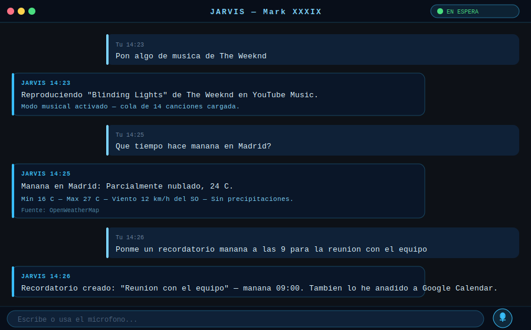

<div align="center">



# JARVIS — Mark XXXIX

**Tu asistente personal de IA, siempre a tu lado**

[](https://python.org)
[](https://pypi.org/project/PyQt6/)
[](https://ai.google.dev)
[](https://creativecommons.org/licenses/by-nc/4.0/)
[](https://microsoft.com/windows)

> **Fork de [MARK XXXIX por FatihMakes](https://github.com/FatihMakes/Mark-XXXIX)** — Extensiones propias: integración completa con YouTube Music (login OAuth, crossfade, exportación/importación de playlists), bridge de WhatsApp, correcciones de estabilidad y nueva interfaz de acciones contextual.

</div>

---

## Modos

| Modo | Descripción | Ver documentación |
|------|-------------|-------------------|
| **Normal** | Chat con IA, control del sistema, calendario, recordatorios, clima | [→ Modo Normal](docs/mode-home.md) |
| **YouTube Music** | Reproductor integrado con tu biblioteca de YouTube Music | [→ Modo Música](docs/mode-music.md) |
| **YouTube Video** | Búsqueda y reproducción de vídeos con reproductor flotante | [→ Modo YouTube](docs/mode-youtube.md) |
| **WhatsApp** | Lee y responde mensajes directamente desde Jarvis | [→ Modo WhatsApp](docs/mode-whatsapp.md) |
| **Gmail** | Gestiona tu bandeja de entrada con IA | [→ Modo Gmail](docs/mode-gmail.md) |
| **Google Drive** | Explora, sube y gestiona tus archivos en la nube | [→ Modo Drive](docs/mode-drive.md) |

---

## Capacidades principales

| Categoría | Funciones |
|-----------|-----------|
| **Voz e IA** | Conversación en tiempo real · Cualquier idioma · Cambio fluido voz/texto · Memoria persistente |
| **Control del sistema** | Abrir apps · Ejecutar comandos · Gestionar archivos · Configuración del SO |
| **Google Workspace** | Calendar · Gmail · Google Drive (login único OAuth) |
| **Comunicación** | WhatsApp · Telegram · Signal · Discord · Instagram DMs |
| **Música** | YouTube Music con crossfade · Exportar/importar playlists · Cola, shuffle, volumen |
| **Vídeo** | YouTube: búsqueda, reproductor flotante, suscripciones, likes |
| **Información** | Clima · Vuelos · Búsqueda web · Noticias |
| **Código y prod.** | Asistente de código · GitHub · Steam/Epic Games |

---

## Instalación rápida

```bash
git clone https://github.com/Jcanaas/JARVIS.git
cd JARVIS
pip install -r requirements.txt
playwright install
python main.py
```

> **Nota:** Necesitas una API key gratuita de [Google Gemini](https://ai.google.dev) y unas credenciales OAuth de Google Cloud (Calendar API, Gmail API, Drive API y YouTube Data API v3). Consulta [Configuración inicial](#configuración-inicial).

---

## Configuración inicial

### 1. API Key de Gemini

1. Ve a [Google AI Studio](https://ai.google.dev) y crea una API key gratuita.
2. Crea `config/api_keys.json`:

```json
{
  "gemini": "TU_API_KEY_AQUI"
}
```

### 2. Credenciales de Google (Calendar · Gmail · Drive · YouTube)

1. Abre [Google Cloud Console](https://console.cloud.google.com).
2. Crea un proyecto nuevo.
3. Activa las APIs: **Google Calendar API**, **Gmail API**, **Google Drive API**, **YouTube Data API v3**.
4. En *Credenciales* → crea una **OAuth 2.0 Client ID** de tipo *Desktop App*.
5. Descarga el JSON y guárdalo como `config/google_credentials.json`.
6. En *Pantalla de consentimiento OAuth* → añade tu cuenta en **Usuarios de prueba**.

Al arrancar la app por primera vez se abrirá el navegador para autorizar el acceso.

### 3. YouTube Music (opcional)

Para reproducir música de tu cuenta:

1. Abre Jarvis y di *"Inicia sesión en YouTube Music"*.
2. Se abrirá el navegador con Google; inicia sesión con tu cuenta.
3. Jarvis detectará la autorización automáticamente.

### 4. WhatsApp

1. Abre el modo WhatsApp en Jarvis.
2. Escanea el código QR con tu teléfono (*WhatsApp → Dispositivos vinculados → Vincular dispositivo*).

---

## Estructura del proyecto

```
Mark-XXXIX/
├── main.py                  — Punto de entrada y router de comandos
├── ui.py                    — Interfaz PyQt6 (6 modos, reproductor)
├── actions/                 — Módulos de integración
│   ├── google_auth.py       — OAuth unificado de Google
│   ├── gmail.py             — Acciones de Gmail
│   ├── gdrive.py            — Acciones de Google Drive
│   ├── google_calendar.py   — Calendario y recordatorios
│   ├── youtube_player.py    — YouTube Data API
│   ├── ytmusic.py           — YouTube Music (login, export/import)
│   ├── ytmusic_headless.py  — Reproductor mpv, crossfade, IPC
│   ├── whatsapp.py          — Bridge de WhatsApp
│   ├── send_message.py      — Telegram, Signal, Discord, Instagram
│   ├── web_search.py        — Búsqueda web
│   ├── weather_report.py    — Clima y previsiones
│   ├── flight_finder.py     — Búsqueda de vuelos
│   ├── screen_processor.py  — Análisis de pantalla/webcam
│   └── paths.py             — Rutas centralizadas (LOCALAPPDATA)
├── core/
│   └── prompt.txt           — Prompt del sistema para la IA
├── memory/                  — Historial y notas persistentes (no en git)
├── config/                  — Credenciales y tokens (no en git)
├── docs/                    — Esta documentación
└── doc/                     — Capturas de pantalla originales
```

---

## Requisitos

| Requisito | Detalle |
|-----------|---------|
| **SO** | Windows 10 / 11 |
| **Python** | 3.11 o 3.12 |
| **Micrófono** | Necesario para interacción por voz |
| **API Key** | Google Gemini (gratuita) |
| **Credenciales Google** | OAuth 2.0 — BYO (ver arriba) |

---

## Diferencias respecto al proyecto original

| Característica | FatihMakes/Mark-XXXIX | Esta versión |
|----------------|----------------------|--------------|
| YouTube Music | Básico | Login OAuth + crossfade + export/import playlists |
| Cierre de mpv | No garantizado | Windows Job Object (`KILL_ON_JOB_CLOSE`) |
| Acciones UI | Botones dispersos | Menú contextual "⋯" en el banner |
| Import/Export | No disponible | JSON con soporte para vídeos (video_id) |
| Idioma principal | Inglés | Español (con soporte multiidioma) |

---

## Licencia y créditos

**Proyecto original:** [MARK XXXIX](https://github.com/FatihMakes/Mark-XXXIX) por [@FatihMakes](https://www.youtube.com/@FatihMakes)  
**Este fork:** Extensiones y personalizaciones por [@Jcanaas](https://github.com/Jcanaas)

Licenciado bajo [Creative Commons BY-NC 4.0](https://creativecommons.org/licenses/by-nc/4.0/) — uso personal y no comercial.
