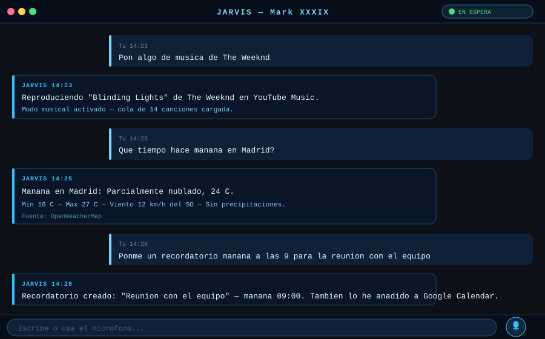

<div align="center">



# JARVIS — Mark XXXIX

**Tu asistente personal de IA, siempre a tu lado**

[](https://python.org)
[](https://pypi.org/project/PyQt6/)
[](https://ai.google.dev)
[](https://creativecommons.org/licenses/by-nc/4.0/)
[](https://microsoft.com/windows)

> **Fork de [MARK XXXIX por FatihMakes](https://github.com/FatihMakes/Mark-XXXIX)** — desde entonces creció mucho más allá del proyecto original: reproductor de música y vídeo completo, cine/series con streaming por torrent, emuladores retro con mando, gestor de cartas Magic, bridge de WhatsApp con IA, agente de navegador y decenas de herramientas de productividad.

</div>

---

## Modos

| Modo | Descripción | Ver documentación |
|------|-------------|-------------------|
| **Normal** | Chat con IA, control del sistema, calendario, recordatorios, clima | [→ Modo Normal](docs/mode-home.md) |
| **YouTube Music** | Reproductor integrado con tu biblioteca de YouTube Music | [→ Modo Música](docs/mode-music.md) |
| **YouTube Video** | Búsqueda y reproducción de vídeos con reproductor flotante | [→ Modo YouTube](docs/mode-youtube.md) |
| **Movies / TV** | Películas y series por streaming (torrent/Stremio) o biblioteca offline, subtítulos automáticos | [→ Movies/TV](ui/panels/movies.py) |
| **Emuladores** | Consolas retro (core libretro), catálogo de ROMs, mando configurable por botón | — |
| **CardTrader** | Catálogo, watchlist y optimizador de compra de cartas Magic | [→ Modo CardTrader](docs/mode-cardtrader.md) |
| **WhatsApp** | Lee y responde mensajes, respuestas sugeridas por IA, reglas automáticas | [→ Modo WhatsApp](docs/mode-whatsapp.md) |
| **Gmail** | Gestiona tu bandeja de entrada con IA | [→ Modo Gmail](docs/mode-gmail.md) |
| **Google Drive** | Explora, sube y gestiona tus archivos en la nube | [→ Modo Drive](docs/mode-drive.md) |

---

## Capacidades principales

| Categoría | Funciones |
|-----------|-----------|
| **Voz e IA** | Conversación en tiempo real · Cualquier idioma · Cambio fluido voz/texto · Memoria persistente |
| **Control del sistema** | Abrir apps · Ejecutar comandos · Gestionar archivos · Configuración del SO |
| **Google Workspace** | Calendar · Gmail · Google Drive (login único OAuth) |
| **Comunicación** | WhatsApp (bridge propio + IA) · Telegram · Signal · Discord · Instagram DMs |
| **Música** | YouTube Music con crossfade · Exportar/importar playlists · Cola, shuffle, volumen · Letras sincronizadas |
| **Vídeo** | YouTube: búsqueda, reproductor flotante, suscripciones, likes |
| **Cine y series** | Streaming por torrent (Torrentio/Stremio) · biblioteca offline · subtítulos (OpenSubtitles, retiming) · traductor de pantalla en vivo |
| **Retro gaming** | Emulación por core libretro (render por GPU) · catálogo de ROMs (Internet Archive) · mando por USB/Bluetooth con bind-by-press |
| **Cartas Magic** | Catálogo CardTrader, watchlist de precios, optimizador de mazos |
| **Descargas** | Gestor de torrents con salud de trackers · descarga de vídeo (yt-dlp) |
| **Información** | Clima · Vuelos · Búsqueda web · Noticias |
| **Código y prod.** | Asistente de código · agente de navegador · GitHub · Steam/Epic Games |

---

## Instalación rápida

```bash
git clone https://github.com/Jcanaas/JARVIS.git
cd JARVIS
pip install -r requirements.txt
playwright install
python main.py
```

> **Nota:** Necesitas una API key gratuita de [Google Gemini](https://ai.google.dev) y unas credenciales OAuth de Google Cloud (Calendar API, Gmail API, Drive API y YouTube Data API v3). Consulta [Configuración inicial](#configuración-inicial).

---

## Configuración inicial

### 1. API Key de Gemini

1. Ve a [Google AI Studio](https://ai.google.dev) y crea una API key gratuita.
2. Crea `config/api_keys.json`:

```json
{
  "gemini": "TU_API_KEY_AQUI"
}
```

### 2. Credenciales de Google (Calendar · Gmail · Drive · YouTube)

1. Abre [Google Cloud Console](https://console.cloud.google.com).
2. Crea un proyecto nuevo.
3. Activa las APIs: **Google Calendar API**, **Gmail API**, **Google Drive API**, **YouTube Data API v3**.
4. En *Credenciales* → crea una **OAuth 2.0 Client ID** de tipo *Desktop App*.
5. Descarga el JSON y guárdalo como `config/google_credentials.json`.
6. En *Pantalla de consentimiento OAuth* → añade tu cuenta en **Usuarios de prueba**.

Al arrancar la app por primera vez se abrirá el navegador para autorizar el acceso.

### 3. YouTube Music (opcional)

Para reproducir música de tu cuenta:

1. Abre Jarvis y di *"Inicia sesión en YouTube Music"*.
2. Se abrirá el navegador con Google; inicia sesión con tu cuenta.
3. Jarvis detectará la autorización automáticamente.

### 4. WhatsApp

1. Abre el modo WhatsApp en Jarvis.
2. Escanea el código QR con tu teléfono (*WhatsApp → Dispositivos vinculados → Vincular dispositivo*).

### 5. Emuladores (opcional)

1. Coloca los cores libretro correspondientes en la carpeta de emuladores.
2. Añade BIOS propias si la consola las requiere (no incluidas por licencia).
3. Configura el mando desde el panel de Emuladores: pulsa cada botón cuando se te pida.

---

## Estructura del proyecto

```
Mark-XXXIX/
├── main.py                  — Punto de entrada y router de comandos
├── ui/                       — Interfaz PyQt6
│   ├── panels/               — Un panel por modo (música, vídeo, movies, emulators, cardtrader, whatsapp, gmail, drive, calendar, games, tv, settings)
│   └── widgets/               — Componentes reutilizables (controles, HUD, overlays, retro, navegación)
├── actions/                 — Módulos de integración (~90 archivos)
│   ├── google_auth.py         — OAuth unificado de Google
│   ├── gmail.py / gdrive.py / google_calendar.py — Workspace
│   ├── youtube_player.py / ytmusic*.py            — YouTube y YouTube Music
│   ├── whatsapp*.py                               — Bridge de WhatsApp, IA, reglas
│   ├── send_message.py                            — Telegram, Signal, Discord, Instagram
│   ├── movie_search.py / torrentio.py / cinemeta.py / offline_library.py — Cine y series
│   ├── opensubtitles.py / subtitle_retime.py / screen_translator.py      — Subtítulos y traducción
│   ├── libretro.py / emulator_runtime.py / rom_catalog.py / gamepad.py / input_config.py / bios.py — Retro gaming
│   ├── cardtrader*.py / deck_parser.py                                   — Cartas Magic
│   ├── torrent_search.py / torrent_download.py / trackers.py             — Descargas
│   ├── browser_control.py / dev_agent.py / code_helper.py                — Agente de navegador y código
│   ├── screen_processor.py / screen_watcher.py                           — Análisis de pantalla/webcam
│   ├── web_search.py / weather_report.py / flight_finder.py              — Información
│   └── paths.py                                                          — Rutas centralizadas (LOCALAPPDATA)
├── core/
│   └── prompt.txt           — Prompt del sistema para la IA
├── memory/                  — Historial y notas persistentes (no en git)
├── config/                  — Credenciales y tokens (no en git)
├── docs/                    — Documentación por modo y planes de features
└── doc/                     — Capturas de pantalla originales
```

---

## Requisitos

| Requisito | Detalle |
|-----------|---------|
| **SO** | Windows 10 / 11 |
| **Python** | 3.11 o 3.12 |
| **Micrófono** | Necesario para interacción por voz |
| **API Key** | Google Gemini (gratuita) |
| **Credenciales Google** | OAuth 2.0 — BYO (ver arriba) |
| **Mando (opcional)** | USB o Bluetooth, para el modo Emuladores |
| **BIOS (opcional)** | Aportadas por el usuario, no incluidas por licencia |

---

## Diferencias respecto al proyecto original

| Característica | FatihMakes/Mark-XXXIX | Esta versión |
|----------------|----------------------|--------------|
| YouTube Music | Básico | Login OAuth + crossfade + export/import playlists + letras |
| Cine y series | No disponible | Streaming por torrent, biblioteca offline, subtítulos y retiming |
| Retro gaming | No disponible | Emulación por core libretro, catálogo de ROMs, mando configurable |
| Cartas Magic | No disponible | Catálogo, watchlist y optimizador CardTrader |
| WhatsApp | No disponible | Bridge propio con respuestas sugeridas por IA y reglas automáticas |
| Agente de navegador | No disponible | Control de navegador y asistente de código integrados |
| Cierre de mpv | No garantizado | Windows Job Object (`KILL_ON_JOB_CLOSE`) |
| Acciones UI | Botones dispersos | Menú contextual "⋯" en el banner |
| Idioma principal | Inglés | Español (con soporte multiidioma) |

---

## Licencia y créditos

**Proyecto original:** [MARK XXXIX](https://github.com/FatihMakes/Mark-XXXIX) por [@FatihMakes](https://www.youtube.com/@FatihMakes)
**Este fork:** Extensiones y personalizaciones por [@Jcanaas](https://github.com/Jcanaas)

Licenciado bajo [Creative Commons BY-NC 4.0](https://creativecommons.org/licenses/by-nc/4.0/) — uso personal y no comercial.
